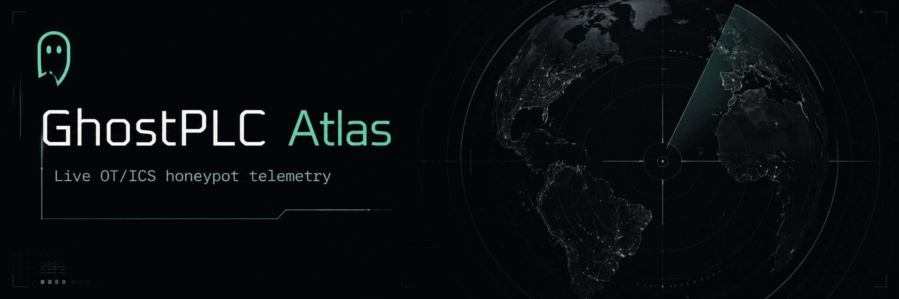
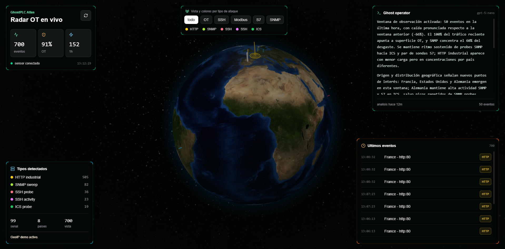

# GhostPLC Atlas



GhostPLC Atlas is a small OT honeypot lab that turns raw internet noise into a dashboard you can actually read.

It has two parts:

- `ghostplc-sensor`: runs near the honeypots, collects events, normalizes them, stores them in SQLite, and exposes a token-protected API.
- `ghostplc-dashboard`: a Next.js dashboard that reads the sensor API and presents the activity as a live operational view.

The goal is not to pretend this is an enterprise SOC. It is an MVP for observing who touches exposed industrial-looking services, which protocols attract attention, and how that activity changes over time.

## What It Looks Like




## Why This Exists

Industrial protocols are noisy when exposed. Even a basic public sensor can receive probes, login attempts, protocol handshakes, and low-effort scans quickly.

GhostPLC Atlas gives that activity a shape:

- Conpot and Cowrie provide realistic-looking targets.
- The collector extracts meaningful events from container logs.
- Private or internal IPs are ignored.
- Source IPs are represented as hashes, not raw addresses.
- SQLite keeps the MVP simple and portable.
- The dashboard consumes only a small JSON API.
- Optional AI analysis can summarize trends without sending raw IPs.

## Architecture

```text
Internet scans
    |
    v
Google Cloud VM
    |
    +-- Conpot honeypot
    +-- Cowrie honeypot
    |
    v
ghostplc-sensor
    |
    +-- collector
    +-- SQLite
    +-- FastAPI /events.json and /analysis
    |
    v
Vercel / Next.js
    |
    v
ghostplc-dashboard
```

Recommended MVP deployment:

- Sensor: Ubuntu VM on Google Cloud Compute Engine.
- Dashboard: Vercel project pointed at `ghostplc-dashboard`.
- Storage: local SQLite on the sensor VM.
- Auth: bearer token between dashboard and sensor.

## Network Exposure

This project deliberately opens a small set of ports because the sensor is a honeypot. The point is to look like exposed OT and remote-access surface while keeping the real administration path separate.

MVP ports:

| Port | Public? | Component | Why it is open |
| --- | --- | --- | --- |
| `80/tcp` | Yes | Conpot | HTTP-looking industrial surface. Easy for generic scanners to find. |
| `102/tcp` | Yes | Conpot | Siemens S7-style target. Useful because S7 is a recognizable ICS protocol. |
| `502/tcp` | Yes | Conpot | Modbus/TCP. Commonly scanned and simple to fingerprint. |
| `161/udp` | Yes | Conpot | SNMP-style noise. UDP may take longer to produce visible events, but it is useful background signal. |
| `2222/tcp` | Yes | Cowrie | SSH honeypot for the MVP without taking over the real SSH port yet. |
| `2223/tcp` | Optional | Cowrie | Telnet honeypot surface. Keep it if you want the extra noise, close it if you want a smaller exposure. |
| `8088/tcp` | Restricted if possible | GhostPLC API | Dashboard API. It uses a bearer token, but it is still better to restrict by source IP or put it behind a proxy later. |
| `22/tcp` | Admin only in MVP | Real SSH | Keep this for administration while validating the sensor. Do not expose it broadly. |
| `50022/tcp` | Admin only in phase 2 | Real SSH | Future admin port before redirecting public `22/tcp` to Cowrie. |

For the first MVP, Cowrie listens publicly on `2222/tcp` and real SSH stays on `22/tcp` for administration. That is less realistic than catching traffic on `22/tcp`, but it is much harder to lock yourself out while testing.

The production-style iteration is:

1. open `50022/tcp` only to your own IP;
2. configure real SSH to listen on `50022`;
3. verify a fresh login on `50022`;
4. only then redirect inbound `22/tcp` to Cowrie on `2222/tcp`.

Do not close your original SSH session until `50022` works. The helper script for the redirect is `ghostplc-sensor/scripts/enable-cowrie-port22-redirect.sh`.

## Security Notes

This repo is meant to show the lab, not leak the lab.

Do not commit runtime secrets or captured data:

- `.env`
- `.env.local`
- SQLite databases
- generated builds
- Python caches
- Node dependencies
- GeoIP databases
- private keys
- captured logs or sensor data

The dashboard should never need direct database access. It should only read the sensor API with a bearer token. For a public deployment, treat `8088/tcp` as the most sensitive exposed port in the MVP because it is the bridge between the sensor and the public dashboard.

## Repository Layout

```text
.
|-- README.md
|-- GHOSTPLC_ATLAS_MVP.md
|-- assets/
|-- ghostplc-dashboard/
|   |-- src/
|   |-- public/
|   |-- package.json
|   `-- .env.example
`-- ghostplc-sensor/
    |-- collector/
    |-- scripts/
    |-- systemd/
    |-- tests/
    |-- docker-compose.yml
    `-- .env.example
```

## Sensor

The sensor is the part that belongs on the VM.

It does four jobs:

1. Run honeypot services with Docker Compose.
2. Parse events from Conpot and Cowrie logs.
3. Store normalized events in SQLite.
4. Serve dashboard-friendly JSON through FastAPI.

Local setup:

```bash
cd ghostplc-sensor
cp .env.example .env
docker compose up -d
python -m venv .venv
. .venv/bin/activate
pip install -r collector/requirements.txt
python -m collector.collector
uvicorn collector.api:app --host 0.0.0.0 --port 8088
```

Useful endpoints:

```text
GET /health
GET /events.json
GET /analysis
```

`/events.json` and `/analysis` require:

```text
Authorization: Bearer YOUR_TOKEN
```

## Dashboard

The dashboard is a Next.js app designed to be deployed separately from the sensor.

Local setup:

```bash
cd ghostplc-dashboard
cp .env.example .env.local
npm ci
npm run dev
```

Open:

```text
http://localhost:3000
```

Environment variables:

```text
SENSOR_EVENTS_URL=http://YOUR_SENSOR_HOST:8088/events.json
SENSOR_ANALYSIS_URL=http://YOUR_SENSOR_HOST:8088/analysis
SENSOR_API_TOKEN=your_sensor_token
SENSOR_FETCH_TIMEOUT_MS=6000
```

## Tests

Sensor:

```bash
cd ghostplc-sensor
python -m pytest
```

Dashboard:

```bash
cd ghostplc-dashboard
npm run lint
npm run build
```

## Deployment Guide

The detailed MVP runbook is in:

```text
GHOSTPLC_ATLAS_MVP.md
```

That document covers the Google Cloud VM, firewall rules, Docker services, systemd units, dashboard environment variables, and operational checklist.

## Current Status

This is an MVP repository, intentionally small:

- enough structure to deploy and test the idea;
- no external database dependency yet;
- no multi-tenant auth layer;
- no production SIEM integration;
- no claim that honeypot output is complete threat intelligence.

Good next steps:

- add real dashboard screenshots to `assets/`;
- add a short demo video or GIF;
- expand CI around the collector parser;
- add deployment docs with sanitized screenshots;
- decide on a license before encouraging reuse.
